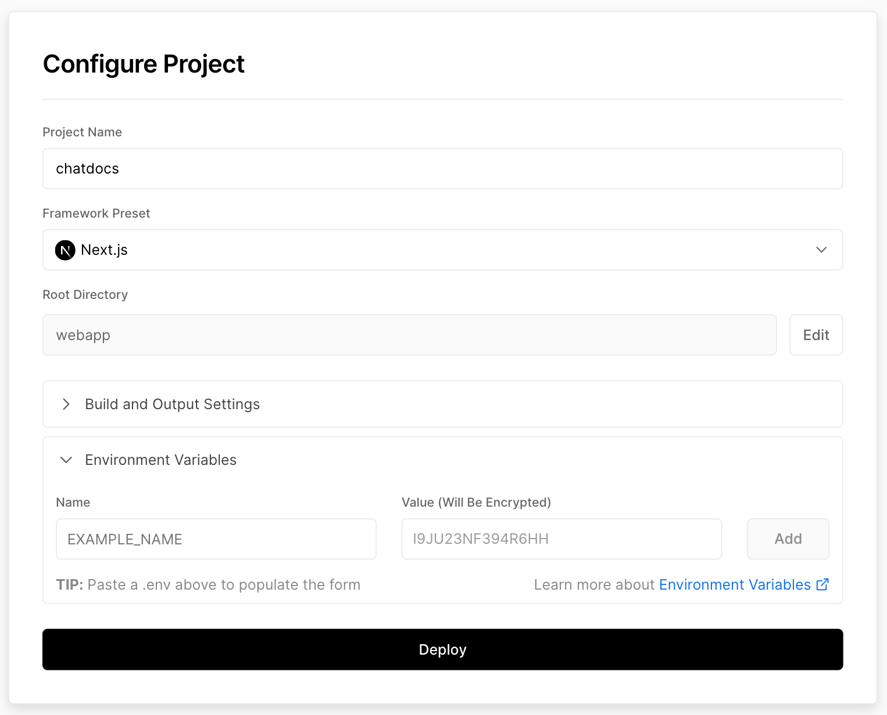
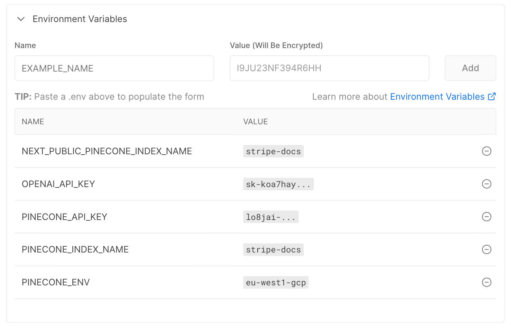

# ChatDocs


ChatDocs is an open-source project that enables you to ask questions about your online documentation and receive real-time answers.

How it works:

1. Index your documentation 📝
2. Deploy the web application 🚀
3. Ask questions 🤔


## Prerequisites 📋

This project uses:

- [OpenAI](https://platform.openai.com/) for generating answers.
- [Pinecone](https://www.pinecone.io/) for indexing the documentation.
- [Vercel](https://vercel.com/) for hosting the web application.

Be sure to have an account and your credentials for each of these services.

> Ensure you have [Node.js](https://nodejs.org/en/) and [Python 3](https://www.python.org/) installed on your machine.

## Architecture 🏛️

The project is composed of the following components:

- `webapp`: folder containing the frontend code for the Q&A website.
- `crawl.py`: Python script to crawl a website and index its content in Pinecone.

## Getting Started 🚀

To get started with ChatDocs, follow these instructions:

### Clone the repository

```sh
git clone https://github.com/ClemDev2000/chatdocs
```

### Install dependencies and setup the project

It will create a Python virtual environment and install the dependencies.

It will also ask your for your **OpenAI** and **Pinecone** credentials.

```sh
sh setup.sh
```

### Customize the project

Edit the `webapp/public/logo.svg` with the logo of your service.

### Index your documentation

- `domain` is your top-level domain (e.g. `stripe.com`).
- `url` is the root URL of the page you want to index (e.g. `https://stripe.com/docs/atlas/`). In that case, the script will crawl all the pages with the following wildcard: `https://stripe.com/docs/atlas/*`.
- `excludes` (optional) is a list of URLs you want to exclude from the index. It can be useful if you want to exclude the homepage or the pricing page.

```sh
# Activate the Python virtual environment
source venv/bin/activate

# Index the documentation
python3 crawl.py \
  --domain stripe.com \
  --url https://stripe.com/docs/atlas \
  --excludes https://stripe.com/docs/api,https://stripe.com/docs/js,https://stripe.com/docs/cli
```

### Running the project locally

Open a terminal and run:

```sh
cd webapp
npm run dev
```

Go to [http://localhost:3000](http://localhost:3000) to see the website.

### Deploy the web application on Vercel

- Go to your dashboard and create a new project.
- Select `Next.js` as the framework preset.
- Select `webapp` as the root directory.
- Copy the content of `webapp/.env.local` into the `Environment Variables` section.
- Click on `Deploy` and wait for the deployment to finish.




## Contributing 🧑‍💻

We welcome contributions to ChatDocs! To get started, follow these steps:

- Fork the repository.
- Create a new branch for your changes.
- Make your changes and commit them to your branch.
- Push your changes to your fork.
- Submit a pull request with a detailed description of your changes.

## Contact 🤙

If you have any questions or comments about ChatDocs or if you want some help to deploy it for your project, please contact us at [hello@dreamcin.com](mailto:hello@dreamcin.com).

We hope you find ChatDocs useful and enjoy using it!

## Creator 🧑🏼‍🎨

Created by [Clément Thiriet](https://cthiriet.com/). A [DreamCin](https://dreamcin.com/) product.
